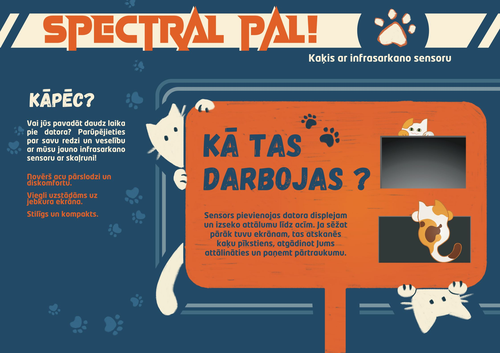

# Spectral-Pal

⚠️ The following project is still in progress and is protected by the copyright.

<h3> 📝 Description:</h3>
<table style="width: 100%;">
  <tr>
     <td style="vertical-align: top; padding-left: 10px;">

   

       Spectral-Pal is a helping device fixed above or below a computer screen to measure the user's distance from the screen. Its main function is to give auditory warnings when the recommended minimum distance is not maintained.  Some prototypes may include connection to the device's screen providing visual reminders.

The prototype is based on C language and uses Arduino UNO and IR (infrared) sensor. As alternatives in the future versions, special circuits may be used. 

    </td>
    <td style="width: 40%; vertical-align: top;">
      
    </td>
    
  </tr>
</table>

### 🔧 Work in progress:
- Adding POMODORO reminders to your screen.
- Adding reminder for when a person sits too long in front of the screen.

### ⚙️ Simulation
🔗 [view the simulation on Tinkercad](https://www.tinkercad.com/things/kJ8C4ohQrSh-spectral-pal?sharecode=h3pmaaNPvNmvdpFNgzQEwLuWjI1L4B5lH18c5Ithxl4)

---
© 2025 Astral-Records. All rights reserved.

This project is for demonstration purposes only.  
No part of this work may be copied, used, or redistributed without explicit permission.
